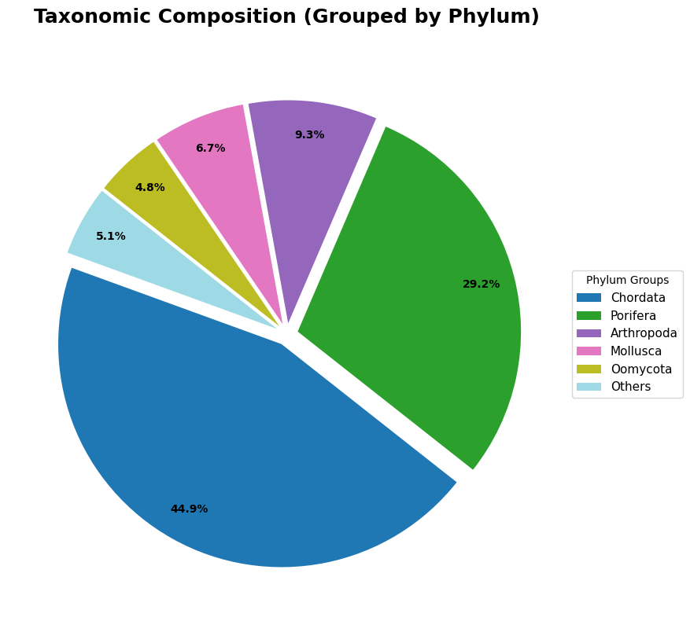
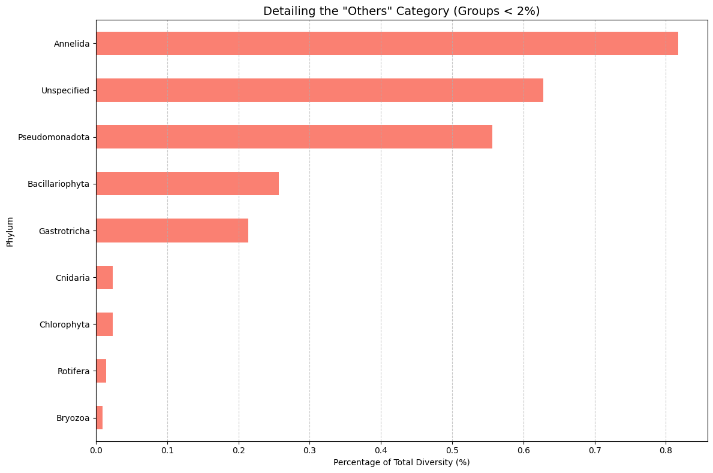
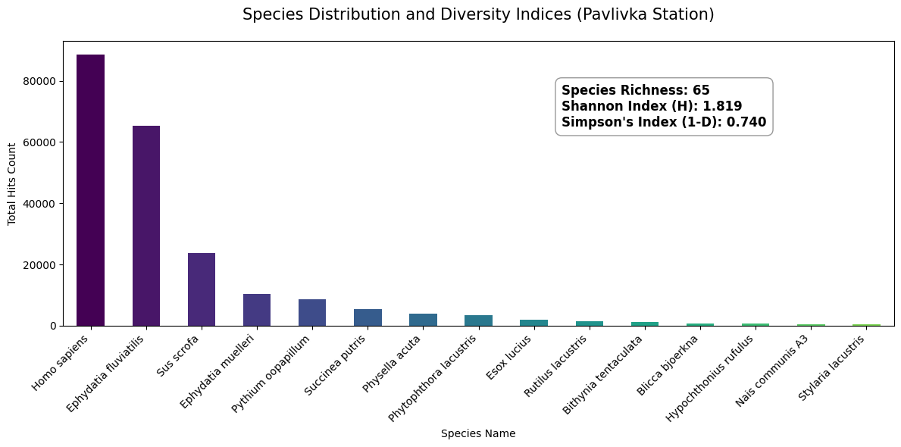
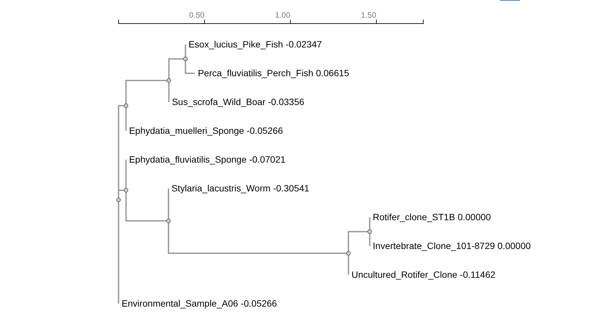

# Pavlivka River eDNA Biodiversity Analysis

This project focuses on analyzing environmental DNA (eDNA) samples from the Pavlivka River. The goal is to identify species diversity and ecosystem health using metabarcoding data processed through MegaBLAST and BOLD systems.

## Visualizations

Below are the results of the taxonomic analysis. These charts were generated using Python (Pandas & Matplotlib) based on the processed eDNA datasets.

### 1. General Taxonomic Composition (Main Groups)
This pie chart displays the dominant Phyla found in the river. To maintain clarity, all groups representing less than 2% of the total diversity are grouped into the **"Others"** category.

### 2. Rare Biosphere (Minority Taxa)
This bar chart provides a detailed look at the species and groups that make up the "Others" category (less than 2% of the total sample). Identifying these rare taxa is crucial for understanding the full biodiversity of the ecosystem.

---
##  Ecological Diversity Analysis (Mlyn Station)

Beyond simple identification, we performed a mathematical analysis of the ecosystem's health using diversity indices. These metrics account for both the number of species and how evenly individuals are distributed among them.

### Biodiversity Metrics

| Metric | Value | Interpretation |
| :--- | :--- | :--- |
| **Species Richness** | [65] | Total number of unique species found |
| **Shannon Index (H)** | [1.819] | Measures uncertainty; higher values mean higher stability |
| **Simpson's Index (1-D)** | [0.740] | Probability that two random individuals belong to different species |

### Scientific Conclusion
A value of 1.819 is significantly high for freshwater ecosystems (typically ranging between 1.5 and 3.5). This indicates a very high species richness and a well-balanced community at the Mlyn station. The ecosystem is complex enough to be resilient against external environmental pressures.

The score of 0.740 (close to the maximum of 1.0) means there is a 74% chance that two random organisms from your sample will be different species. This proves that the Pavlivka River at this point is not dominated by a single "pollution-tolerant" species, which is a key indicator of a clean and healthy environment.

Conclusion: The combination of a high Shannon Index and a near-perfect Simpson Index confirms that the Pavlivka station serves as a biodiversity hotspot. The data suggests minimal anthropogenic stress and a high capacity for self-regulation within the aquatic community.

---
#  Molecular Verification and Phylogenetic Inference 

This section details the bioinformatic validation and evolutionary analysis of environmental DNA (eDNA) recovered from the **Pavlivka ecosystem**. These steps ensure the taxonomic identifications are biologically grounded and statistically significant.

## 1. Molecular Validation (ORF Verification)
To ensure the sequences were not degraded "noise" or non-functional pseudogenes, we analyzed the coding potential of the 730 bp COI barcodes.

* **Methodology:** The nucleotide sequences were translated into amino acid sequences across three different reading frames.
* **Key Finding:** Analysis of `translate.txt` reveals a continuous **Open Reading Frame (ORF)** in **Frame 3**.
* **Interpretation:** The absence of internal stop codons (represented by `*` in the sequence) proves that the eDNA captured represents functional mitochondrial genes. This confirms the biological validity of the data and rules out the presence of nuclear mitochondrial DNA segments (**numts**).

## 2. Phylogenetic Tree Reconstruction
We reconstructed the evolutionary history of the Pavlivka taxa to verify that their genetic distances align with established biological systematics.

* **Algorithm:** Neighbor-Joining (NJ) based on the **Kimura 2-parameter (K2P)** model.
* **Visualization:** 

* **Structure (based on `.tree` and `.nj` files):**
    * **Chordata Cluster:** High-order grouping of *Esox lucius* (Pike), *Perca fluviatilis* (Perch), and *Sus scrofa* (Wild Boar).
    * **Porifera Cluster:** A distinct branch for *Ephydatia* species, highlighting their basal evolutionary position.
    * **Invertebrate Microfauna:** A highly divergent cluster containing *Stylaria lacustris* and *Rotifers*.

## 3. Percent Identity Matrix (PIM)
The following table summarizes the genetic similarity between key taxa. This matrix (derived from `simple_phylogeny-I20260513-233959-0405-8735972-p1m.pim`) provides mathematical evidence for species identification.

| Taxon A | Taxon B | Similarity (%) | Scientific Significance |
| :--- | :--- | :---: | :--- |
| *Esox lucius* (Pike) | *Perca fluviatilis* (Perch) | **95.90%** | High conservation within Actinopterygii classes. |
| *Ephydatia fluviatilis* | *Ephydatia muelleri* | **100.00%** | Genetic identity at this specific COI locus. |
| *Sus scrofa* (Boar) | *Perca fluviatilis* (Perch) | **87.23%** | Clear divergence between Mammalia and Fish. |
| *Esox lucius* (Pike) | *Ephydatia* (Sponge) | **71.54%** | Deep evolutionary split between phyla. |
| *Rotifer* (Microfauna) | *Chordata* (Vertebrates) | **37.90%** | Baseline similarity; indicates maximum distance. |

## 4. Evolutionary Distance Calculation
Using the **Kimura 2-parameter model** (as seen in `.nj` and `.out` files), we calculated the percentage divergence:

1.  **Low Divergence (DIST = 0.0427):** Observed between *Esox lucius* and *Perca fluviatilis*, confirming a recent common ancestor.
2.  **High Divergence (DIST > 1.10):** Observed between the *Rotifer* samples and all *Chordata*, validating the vast taxonomic breadth captured in the sample.

---

### Data Availability
The raw bioinformatic outputs are available in this repository:
* `simple_phylogeny...tree`: Newick format tree.
* `simple_phylogeny...pim`: Raw Percent Identity Matrix.
* `translate.txt`: Full amino acid translation report.
  
---
##  Tools Used

- **Galaxy Europe**: For primary sequence processing and taxonomic assignment.
- **Python 3.x**: For data cleaning and visualization.
- **Google Colab**: Used as the primary environment for executing visualization scripts.
- **GitHub Copilot**: Assisted in optimizing the visualization code and data grouping logic.

---

##  Project Structure

- `Final_eDNA_Report_Pavlivka.csv`: The complete merged dataset containing BLAST and BOLD results.
- `visualize_edna.py`: Python script used to generate the charts.
- `main_composition.png`: High-resolution pie chart image.
- `minority_details.png`: Detailed bar chart of rare taxa.
